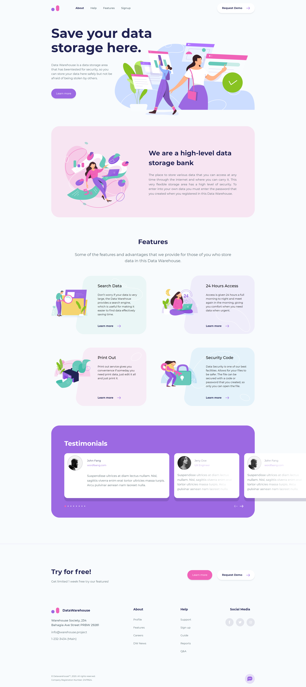

# Data Warehouse Landing Page

Elegant and clean template for any kind of project.

## Table of contents

- [Overview](#overview)
  - [Project Structure](#project-structure)
- [My process](#my-process)
  - [Built with](#built-with)
- [Installation](#installation)
- [Screenshot](#screenshot)
- [Credits](#credits)

## Overview

### Project Structure

css/main.css file is created from main.scss file which is inside the scss folder. main.scss file is used to import the other scss files. CSS codes of the components of the website are included in the scss/pages/index.scss. CSS codes of the header and footer are included in the scss/global folder. 

PugJS is used as a template engine. Files of the template are in the views folder. Files in the views/component and views/global folder are extended from the file called master.pug. HTML codes of the common components of the website are included in the views/component which is in the views folder.

## My process

### Built with

- Semantic HTML5 markup
- CSS custom properties
- CSS Flexbox
- CSS Grid
- Mobile-first workflow
- SVG Using

## Installation

```bash
git clone https://github.com/fundakartal/data-warehouse-landing-page.git
cd data-warehouse-landing-page
npm install or yarn install
```

## Start the server

```bash
gulp
```

Now enter [`localhost:3000`](http://localhost:3000) in the address bar of your browser.

### Screenshot



### Credits

- Design: Data Warehouse Landing Page for Figma by SLAB Design Studio